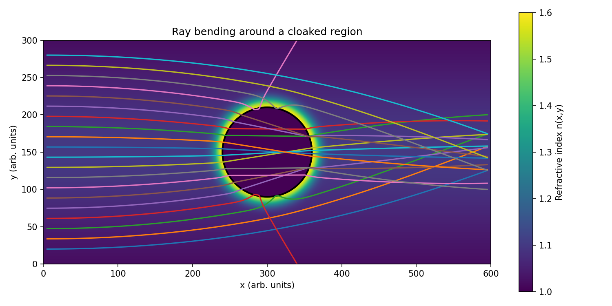
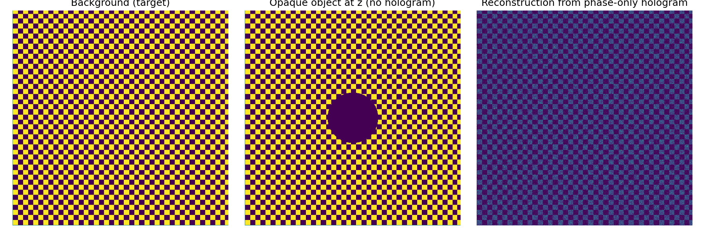

# Reconstruction-of-Cloaked-Objects-from-Phase-Only-Holograms-2

**This codebase contains two main simulations:**
1. Refraction Cloak Ray Tracing
• 	Purpose: Simulates how light rays bend around a cloaked region using a gradient-index (GRIN) medium.
• 	Core Concept: Based on Fermat’s Principle, light rays follow paths that minimize optical distance. By engineering a spatially varying refractive index, rays are guided around a circular region, effectively "cloaking" it.
**• 	Key Functions:**
• 	: Creates a 2D refractive index field with a cloaked region.
• 	: Numerically traces rays through the medium using gradient-based updates.
• 	: Visualizes the refractive index and ray paths, optionally animating them.
• 	Output: Static image () and animated video () saved to the desktop.
2. Holographic Camouflage Simulation
• 	Purpose: Demonstrates how a phase-only hologram can reconstruct a background scene, effectively hiding an object.
• 	Core Concept: Uses angular spectrum propagation to simulate light field evolution and reconstruct a target image from a hologram.
**• 	Key Functions:**
• 	: Implements angular spectrum method for wave propagation.
• 	: Generates a synthetic background pattern.
• 	: Extracts phase-only hologram from a complex wavefront.
• 	Output: Three-panel comparison image () and the hologram phase map ().

**📄 Abstract**
This project presents two computational optics simulations that explore advanced concepts in wave and ray optics. The first module models a gradient-index (GRIN) medium that bends light rays around a circular region, demonstrating a rudimentary form of optical cloaking. The second module simulates holographic camouflage using phase-only holography and angular spectrum propagation, reconstructing a background scene to obscure an object. Both simulations leverage Python’s scientific stack (NumPy, Matplotlib) and produce visual outputs that illustrate the principles of refraction and wavefront engineering. These tools offer intuitive insight into modern photonics and computational imaging.
# Optical Cloaking & Holographic Camouflage Simulations

## Overview
This repository contains two Python-based simulations:
1. **Refraction Cloak Ray Tracing** Simulates light rays bending around a cloaked region using a gradient-index medium.
2. **Holographic Camouflage** Demonstrates how a phase-only hologram can reconstruct a background scene to hide an object.

## Requirements
- Python 3.x
- NumPy
- Matplotlib
- Pillow (for image loading)
- FFMPEG (for saving animations as MP4)

## Files Generated
- `refraction_cloak_ray_demo.png`: Static image of ray paths around the cloak.
- `ray_cloak_animation.mp4`: Animated ray tracing video.
- `hologram_camouflage_panels.png`: Three-panel comparison of holographic camouflage.
- `hologram_phase.png`: Phase-only hologram visualization.

## How to Run
For ease of work, run the python file "main.py" or the jupyter notebook file in a single cell.
